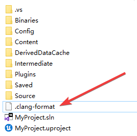
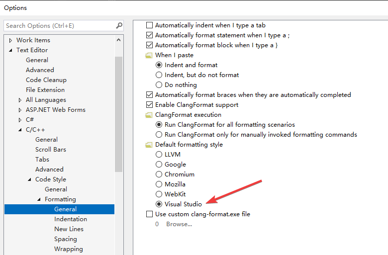
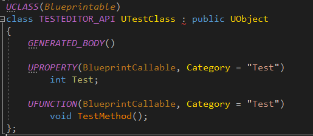
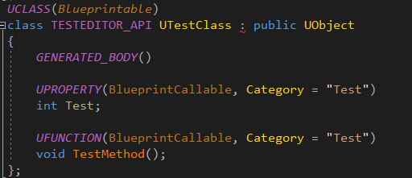

# clang-format_UnrealEngine
Format c++ code for Unreal Engine

## How to use
- Download .clang-format file
- Copy and paste it to your project:

    

- In visual studio press Ctrl+K,Ctrl+D format code

-----
### Details
- .clang-format is a mirror from [Link](https://gist.github.com/intinig/9bba3a3faee80250b781bf916a4ab8b7)

- When have .clang-format file visual studio can override default coding style
    
    

- Before vs after

    
    
    